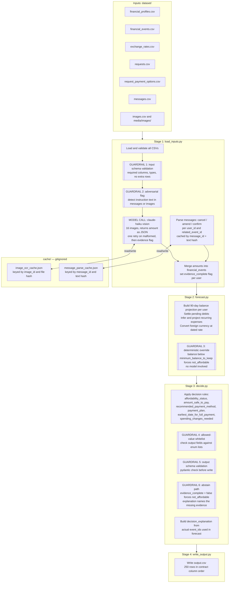

# 01 — Architecture

## Build Diagram

## Pipeline Stages

1. `load_inputs.py` loads all eight sources and runs input schema validation. It runs OCR on the 16 images, parses the 215 messages, and merges the results. It sets the `evidence_complete` flag per user.
2. `forecast.py` builds a 90-day running balance per user. It settles pending debits, infers recurring expenses from history, and converts foreign-currency amounts at the correct dated rate.
3. `decide.py` applies deterministic rules to produce all eight output fields. The `decision_explanation` text comes from the actual event IDs used in the forecast.
4. `write_output.py` validates all output fields against the schema whitelist and writes `output.csv` in contract column order.

## What the Model Decides / What Code Decides / What Nobody Decides

The model decides (Stage 1 only):

- The numeric amount inside each of the 16 images
- Whether a message cancels, amends, delays, or acknowledges a financial event

Code decides (Stages 2 and 3):

- The 90-day balance forecast
- `affordability_status`, `amount_safe_to_pay`, `recommended_payment_method`
- Which installment option to select from `request_payment_options.csv`
- `payment_plan` date-amount pairs
- `earliest_date_for_full_payment`
- `spending_changes_needed` (only non-protected flexible events)
- `decision_explanation` text (generated from used event IDs, not written by the model)

Nobody decides (abstain path):

- If `evidence_complete` is false for a user, we cap their requests at `not_affordable` with `amount_safe_to_pay = 0`.
- If a message parse fails after one retry, we ignore the message and log the gap.

## Guardrail Seams

| Seam | Stage | File |
|---|---|---|
| Input schema validation (required columns, types, row count) | Stage 1 | `load_inputs.py` |
| Adversarial flag (instruction text in messages or images) | Stage 1 | `load_inputs.py` |
| Deterministic override (balance below minimum_balance_to_keep) | Stage 2 | `forecast.py` |
| Allowed-value whitelist (affordability_status and recommended_payment_method enums) | Stage 3 | `decide.py` |
| Output schema validation (all 8 fields present, correct types) | Stage 3 | `decide.py` |
| Abstain path (evidence_complete = false forces not_affordable) | Stage 3 | `decide.py` |

## Why This Shape

We put all model work in Stage 1 so that Stages 2 and 3 are pure arithmetic. When we change a threshold or rule, we re-run Stages 2 and 3 against cached model observations at no cost.

## What We Are Deliberately Not Building

- A router or specialist agents: the decision rules are fully enumerable, and a router adds a failure mode with no benefit.
- Embedding-based retrieval over messages: every relevant message is reachable via a foreign-key join on `user_id` and `related_event_id`, so semantic search solves a problem this dataset does not have.
- Per-record model calls for the decision: the 250 decisions are fully deterministic once we know the 16 image amounts and the message amendments.
