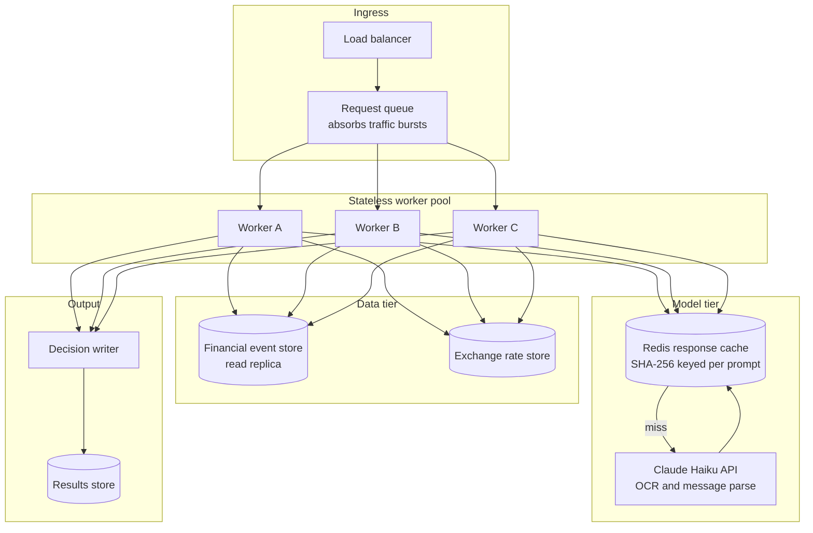

# 04 — Production

Target state: the diagram below shows how the system runs at real scale.
What we shipped: a single-process CLI batch job, `python3 code/main.py`.

---

## Production Diagram

---

## Deployment shape

This problem is request-response, not batch. A user submits a purchase request and expects a decision within seconds. We ship a batch CLI for the contest. In production we wrap the same pipeline in a REST endpoint. The tradeoff is that a service needs uptime and a batch job does not.

## Scale

At 10x volume (2,500 requests per hour) the model API is the bottleneck. There are 231 model calls per 250 requests. At 10x that is 2,310 calls per hour. We address this by adding worker pods and raising the concurrency cap. At 100x (25,000 requests per hour) the cache hit rate matters more. We move the cache from disk to Redis so all workers share it.

## Statelessness

Workers hold no state between requests. They read inputs and write a result. Adding workers requires no session sharing. The only shared artifact is the response cache. We move the cache to Redis, and workers are fully stateless.

## Latency

Stage 1 (OCR and message parse) takes about 3 to 4 minutes for 231 model calls at a concurrency cap of 5. Stages 2 and 3 are sub-second per request. In a real-time service, OCR and message parse must complete first. These are projected figures based on typical Haiku API latency, not measured service-level targets: estimated P50 around 2 seconds per request, estimated P99 around 8 seconds.

## Reliability

If the model API is down, Stage 1 fails for any request with a new image or message. Stages 2 and 3 still run using the last cached parse results. For users whose images were not parsed, the decision uses `evidence_complete = false` and downgrades to `not_affordable`. This degrades rather than crashes.

## Cost

One full run of 250 requests costs about USD 0.10 (`claude-haiku-4-5-20251001` at USD 1.00/1M input and USD 5.00/1M output, 2026-09-12). This breaks down to 215 message parses at USD 0.000350 each and 16 image OCRs at USD 0.001600 each. If inputs are unchanged, the cache replays all results and repeat runs cost USD 0.00. Rejecting adversarial messages at the input stage skips the model call and reduces cost.

## Data and privacy

User financial data does not leave the system except in the model calls for OCR and message parsing. The prompt contains only the image or the message text. We do not send the user's full profile or event history to the model. In production we set a retention policy on the cache and encrypt it at rest.

## Monitoring

We monitor per-field accuracy on a held-out sample, re-evaluated weekly. A 5 percentage-point drop from baseline `affordability_status` accuracy triggers an alert. Output quality degradation is the primary signal, not service uptime.

## Model updates

To change the model version, clear the response cache and run the self-test in `code/decide.py` against `dataset/sample_requests.csv`. If per-field accuracy stays within 2 percentage points of the baseline, the new model is safe. If not, keep the old model. Investigate the regression first.

## Human in the loop

If `spending_changes_needed` is not `none`, a human advisor must review the request. The review must complete first. The advisor sees the full event history, the projected cash flows, and the explanation. In production we add a `needs_review` flag to the output row.

## Known failure modes

**Salary amendment missed**: a message amends the next salary but has no `related_event_id`. We parse the amendment but do not apply it (see `_apply_messages` in `forecast.py`, which requires a non-empty `related_event_id`). The forecast uses the recurring-pattern salary instead. Planned: compare the recurring-pattern salary against the message-stated amount and flag the gap. Not yet implemented. See `docs/05-limits.md` limit 3.

**Outlier filter removes a valid expense**: we filter event amounts outside 50% to 150% of the category median. A user with one large unusual expense in a normally small category loses that expense from the projection. The balance is overstated. We detect this by watching for `amount_safe_to_pay` values much larger than recent spending headroom.

**Desired-completion date equals request date**: our code does not guard against this case. We have not tested it. If the balance is sufficient, `earliest_full_payment_date` returns the request date, which is correct. If the balance is not sufficient it returns `None`, which produces `not_affordable`. That is the right answer but we have not confirmed it.
