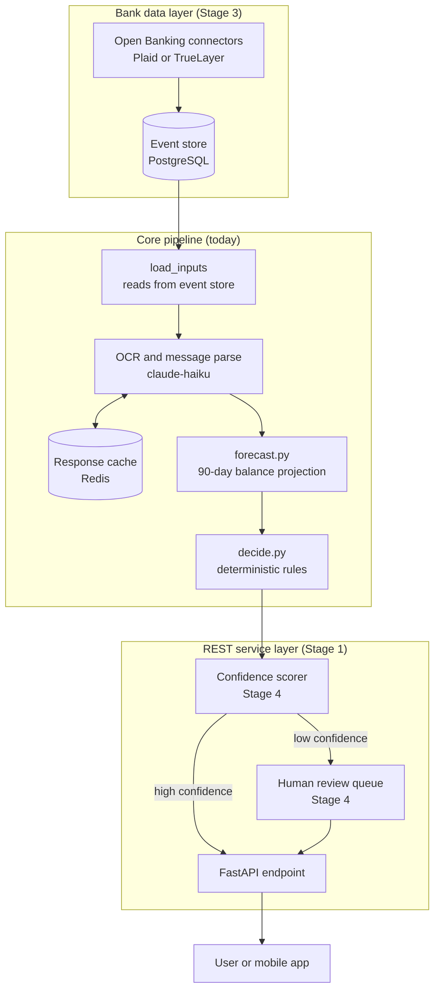

# 06 — Future

This is the staged extension path from what we shipped today. Each stage names what we add, what it unlocks, what has to change in the code, and rough effort.

---

## Stage 1 — REST service wrapper (1 week)

What we add: a FastAPI endpoint that accepts a request payload and returns a decision JSON object. The pipeline stages become functions called per request.

What it unlocks: any frontend or mobile app can call the agent in real time. The contest CLI becomes a thin client that calls the same endpoint.

What has to change: `code/main.py` gains a FastAPI router. `load_inputs.py` must accept per-request data instead of loading all CSV files at startup. `forecast.py` and `decide.py` require no changes.

Rough effort: 3 to 5 days.

---

## Stage 2 — Persistent event store (2 weeks)

What we add: a PostgreSQL table for financial events, replacing `financial_events.csv`. Profiles and exchange rates move to tables as well.

What it unlocks: live event ingestion from bank APIs or webhooks. Forecasts reflect the user's actual balance in real time rather than a snapshot.

What has to change: `load_inputs.py` queries the database instead of reading CSVs. Connection pooling is added at the data tier. `forecast.py` and `decide.py` require no changes.

Rough effort: 1 to 2 weeks.

---

## Stage 3 — Live bank data connectors (3 weeks)

What we add: Open Banking API connectors (for example, Plaid or TrueLayer) that ingest transactions automatically into the event store from Stage 2.

What it unlocks: zero manual data entry. The user's financial events stay current without uploading files.

What has to change: a new `code/connectors/` module polls or receives webhooks from each bank provider. `load_inputs.py` adds a sync step that runs before forecast builds.

Rough effort: 2 to 4 weeks per banking region.

---

## Stage 4 — Confidence scoring and human review queue (2 weeks)

What we add: a confidence score per decision and an escalation queue for low-confidence or high-value requests.

What it unlocks: a safe fallback for regulated contexts. High-value decisions go to a human advisor. Low-value, high-confidence decisions clear automatically.

What has to change: `decide.py` gains a `confidence()` function that scores each decision. A new `code/queue.py` module pushes low-confidence rows to a review queue. The REST endpoint from Stage 1 returns the confidence score alongside the decision.

Rough effort: 1 to 2 weeks.

---

## Extended System Diagram

> Future state. Today's pipeline is the inner box labelled "Core pipeline (today)".

